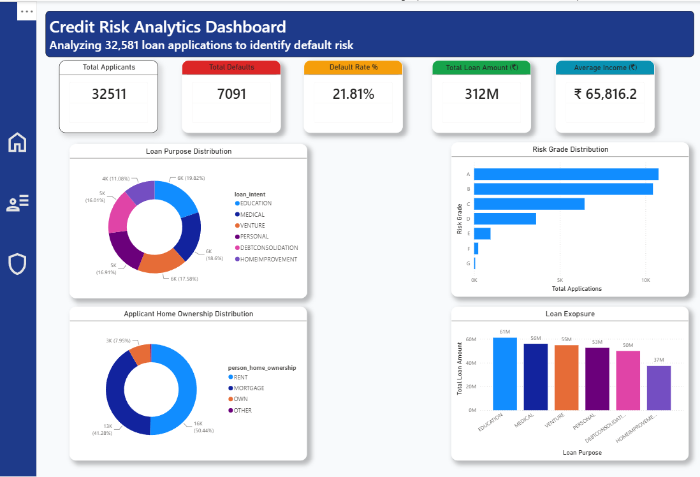
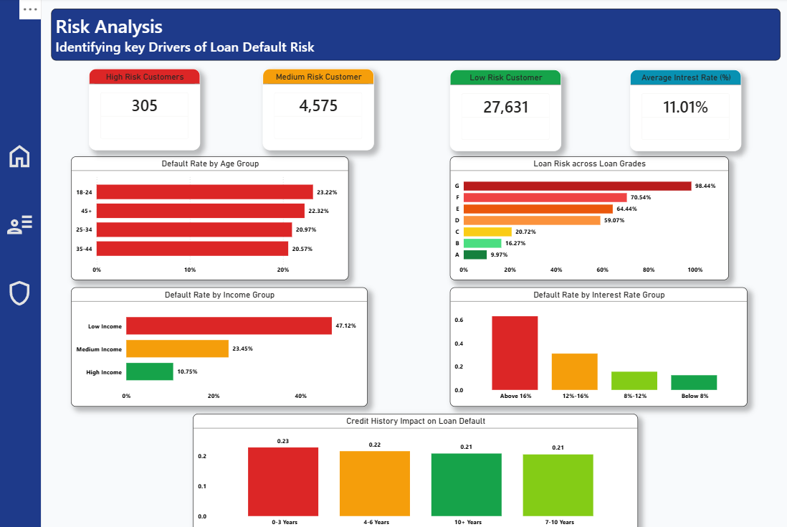
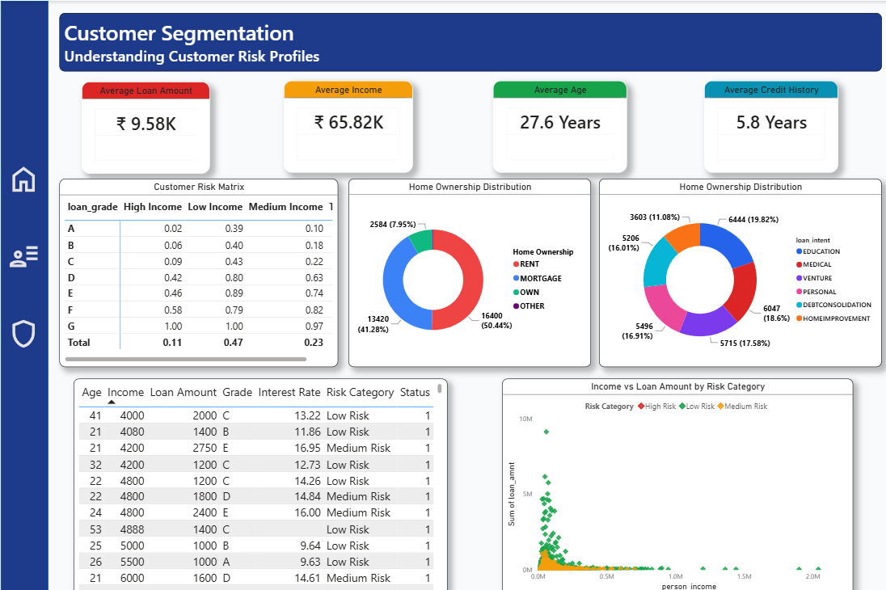

# 📊 Credit Risk Analytics Dashboard

> **An interactive Business Intelligence dashboard that analyzes 32,581 loan applications to identify credit risk, monitor portfolio health, and support data-driven lending decisions.**


---

# Dashboard Preview

## Executive Dashboard



---

## Risk Analysis



---

## Customer Segmentation



---

# Project Overview

Financial institutions rely on credit risk analysis to evaluate borrowers before approving loans. Poor risk assessment can result in increased loan defaults, financial losses, and reduced portfolio performance.

This project demonstrates how **Power BI**, **SQL**, and **Excel** can be combined to transform raw loan data into an interactive analytics solution that helps stakeholders understand customer behavior, identify high-risk applicants, and make informed lending decisions.

---

# Business Problem

Banks receive thousands of loan applications every day. Manually identifying risky borrowers is both time-consuming and inefficient.

This dashboard addresses questions such as:

- Which customer groups are most likely to default?
- How does credit grade affect loan performance?
- Which loan purposes carry the highest exposure?
- How do income and age influence credit risk?
- Which customer segments require closer monitoring?

---

# Solution

The project converts raw loan application data into a multi-page Power BI dashboard that enables users to:

- Monitor overall loan portfolio health
- Identify high-risk customer segments
- Analyze applicant demographics
- Evaluate loan exposure across different categories
- Explore relationships between income, loan amount, and default risk

---

# Dashboard Features

### Executive Dashboard

- Overall portfolio summary
- Total applicants
- Default rate
- Loan exposure
- Average income
- Risk grade distribution
- Loan purpose analysis

---

### Risk Analysis

- High, Medium, and Low Risk segmentation
- Default rate by age
- Default rate by income
- Interest rate impact
- Credit history analysis
- Loan grade comparison

---

### Customer Segmentation

- Customer risk matrix
- Home ownership distribution
- Loan purpose segmentation
- Income vs Loan Amount analysis
- Individual customer records
- Risk category exploration

---

# Tech Stack

| Technology | Purpose |
|------------|---------|
| Power BI | Dashboard Development |
| SQL | Data Querying |
| Excel | Data Cleaning |
| Power Query | Data Transformation |
| DAX | KPI Calculations |

---

# Key Performance Indicators (KPIs)

- 📄 Total Loan Applications
- ❌ Total Defaults
- 📉 Default Rate
- 💰 Total Loan Amount
- 💵 Average Income
- 👥 Customer Risk Categories
- 📊 Average Loan Amount
- 🎯 Average Credit History
- 📈 Average Interest Rate

---

# Business Insights

The dashboard reveals several important patterns:

- Applicants with lower credit grades exhibit significantly higher default rates.
- Lower-income customers demonstrate a higher likelihood of loan default.
- Higher interest rates are associated with increased borrower risk.
- Credit history length plays a measurable role in repayment performance.
- Different loan purposes contribute varying levels of financial exposure.
- Customer segmentation enables targeted risk assessment rather than treating every borrower equally.

---

# Project Structure

```text
Credit-Risk-Analytics-Dashboard
│
├── Dashboard
│   └── Credit Risk Analytics Dashboard.pbix
│
├── Dataset
│   └── loan_data.csv
│
├── SQL
│   └── credit_risk_queries.sql
│
├── Images
│   ├── dashboard_page1.png
│   ├── dashboard_page2.png
│   └── dashboard_page3.png
│
├── README.md
└── LICENSE
```

---

# Dataset

The project uses a publicly available loan dataset containing over **32,000 loan applications**.

### Important Attributes

- Applicant Age
- Income
- Loan Amount
- Interest Rate
- Credit History Length
- Loan Grade
- Loan Purpose
- Home Ownership
- Loan Status

---

# Skills Demonstrated

- Data Cleaning
- Data Modeling
- SQL Querying
- DAX Calculations
- Power Query
- Dashboard Design
- Business Intelligence
- Credit Risk Analytics
- Data Storytelling

---

# Future Enhancements

- Machine Learning-based default prediction
- Streamlit web application
- Automated SQL ETL pipeline
- Real-time database integration
- Drill-through customer profiling
- Explainable AI risk scoring

---

# About Me

**Swapnil Chavan**

🎓 MCA (Artificial Intelligence & Machine Learning)

💼 Aspiring Data Analyst | Business Intelligence Enthusiast

- LinkedIn: https://www.linkedin.com/in/swapnil-chavan-7b413124a/
- GitHub: https://github.com/awschavan

---

⭐ If you found this project useful, consider giving it a star!
